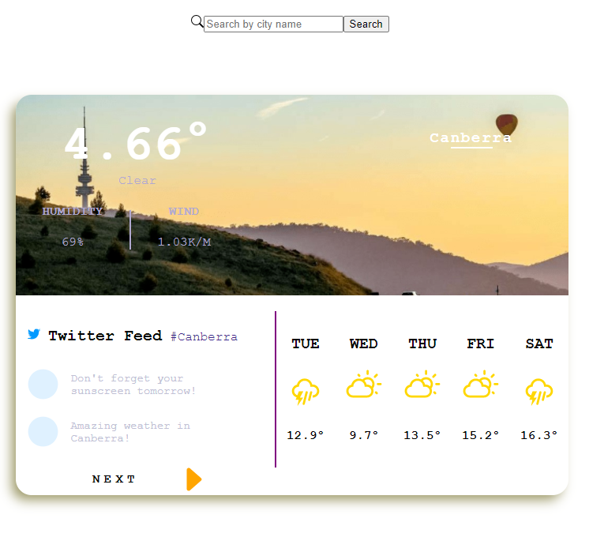

# Project2 Weather API with React

## This project is an React weather web project which use OpenWeather API to display current weather of a city and five days forcast.

### This project inclues Axios, scss and react.

- Use Axios to fetch weather data

### Finished features:

- Five days weather forcast display
- Current weather display

### Need to do:

- Media qeuery which change UI to display on Mobile correctly
- SCSS modification
- code refactor for (Readable, reuseable and maintable)

### current project website

https://camillechang.github.io/project2_v1/
